# Linear and Logistic regression model implementation

__Custom implementation of the univariate linear regression, linear logistic regression and polynomial logistic regression with regularization. Only the python `numpy` library is used along with `matplotlib` for plots in `jupyter notebook`.__

## Univariate linear regression

### Visualizing our first dataset.

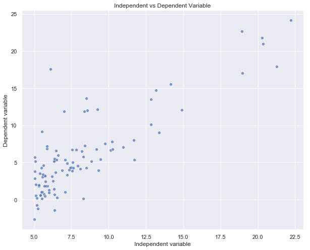

#### Hypothesis function
 

#### Loss/Cost function
 

#### Gradient descent
 

#### Loss curve and final best fit line with Gradient descent
Loss curve plotted along with the final best fit line after running 103 iterations of the Gradient descent update equations.
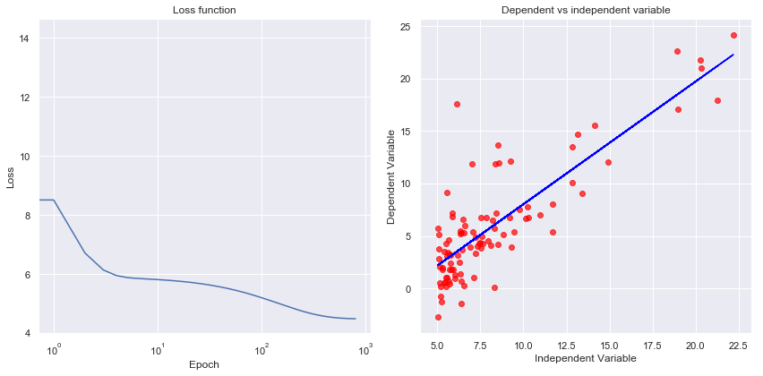

#### Final best fit line with Normal equations method
The final best fit line after the normal equations method.
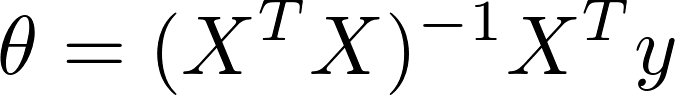

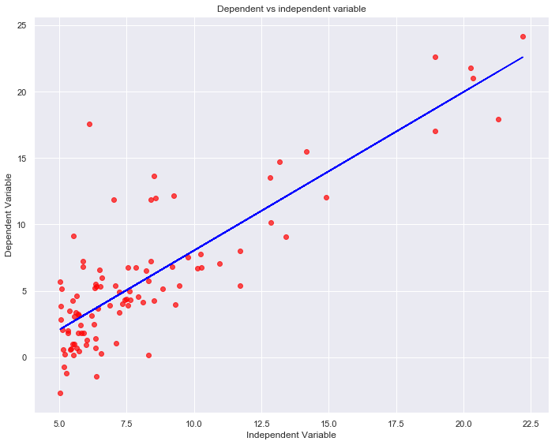

## Linear Logistic Regression

### Visualizing our second dataset.

2D representation       |  3D Representation
:----------------------:|:----------------------:
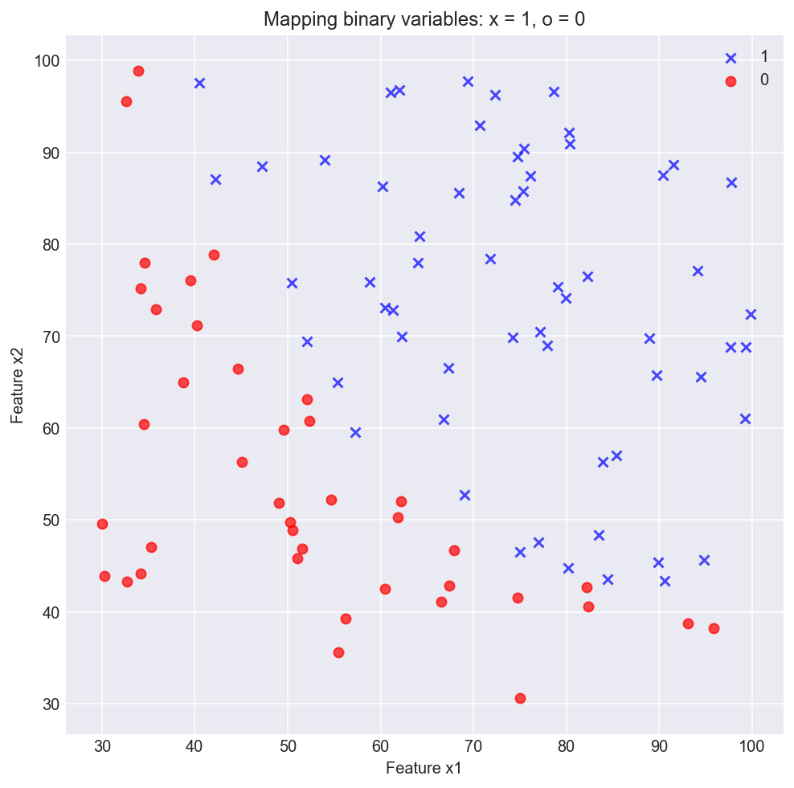  |  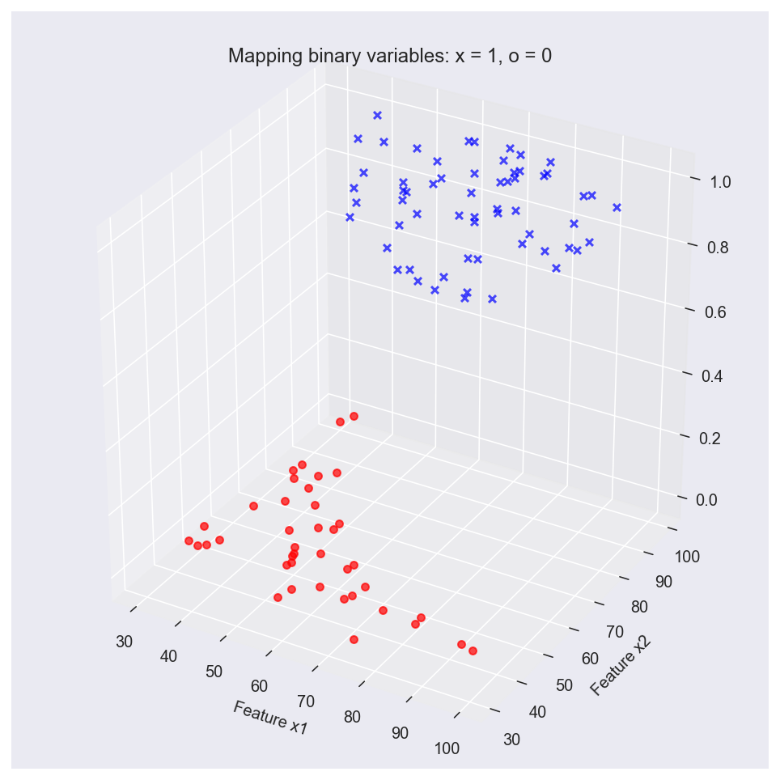

#### Hypothesis function

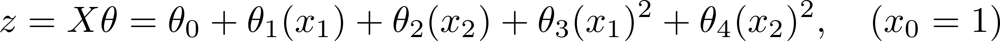

#### Loss/Cost function
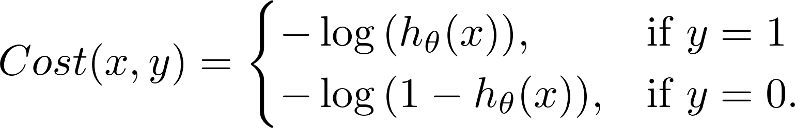

#### Gradient descent

#### Loss curve and final boundary line using a linear function.
Here we use a linear function  to model our data. This is why our boundary line is a straight line which fits the data pretty well but we can clearly see that a polynomial model can fit the data better.

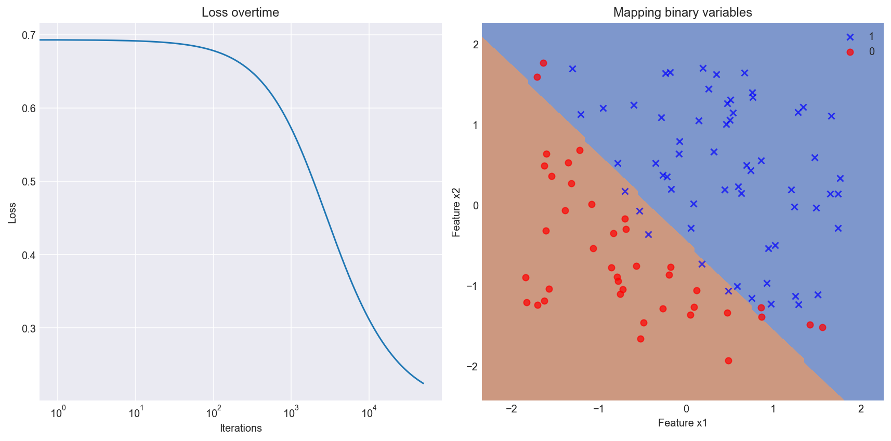

## Polynomial Logistic Regression

#### Loss curve and final boundary line using a polynomial function.
Here we use a polynomial hypothesis function  to model our data. Now our boundary line is a curved line which fits the data much better than the previous linear model.

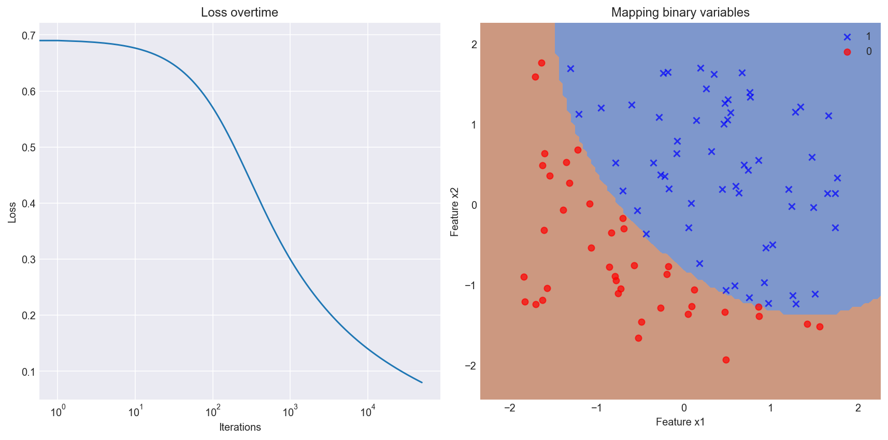

### Visualizing our third dataset.

2D representation       |  3D Representation
:----------------------:|:----------------------:
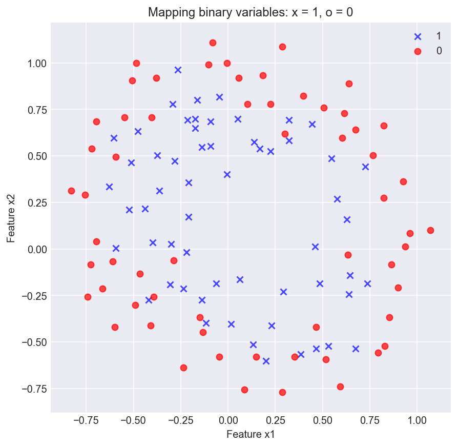  |  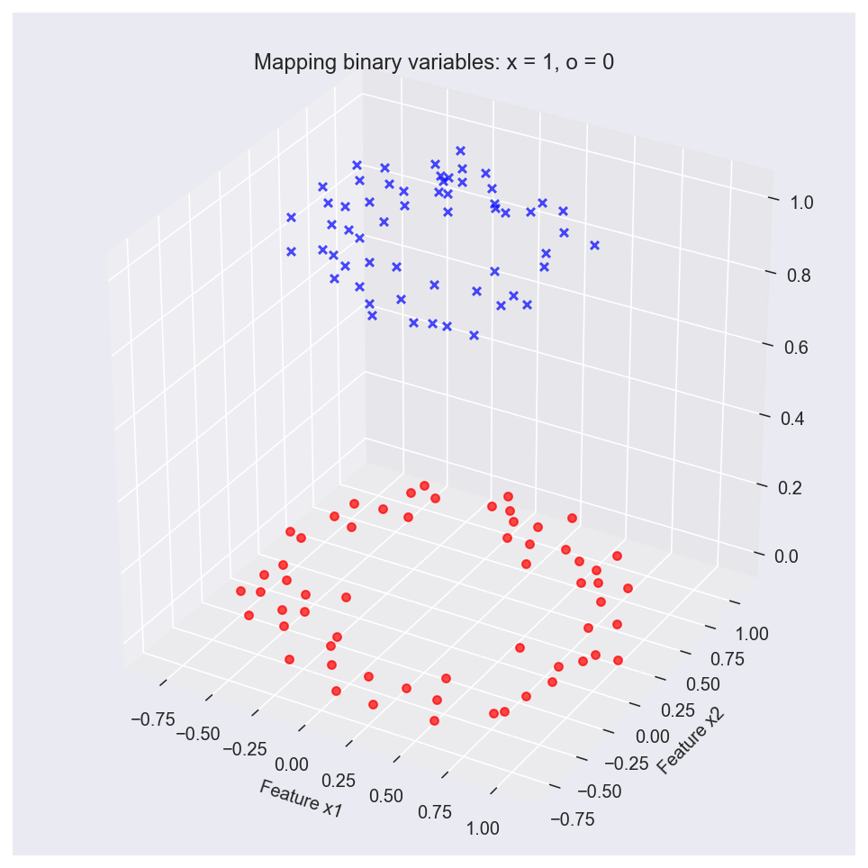

#### Hypothesis function

#### Loss/Cost function

#### Gradient descent

#### Loss curve and final boundary line using a polynomial function.
Here we use a polynomial function  to model our data.

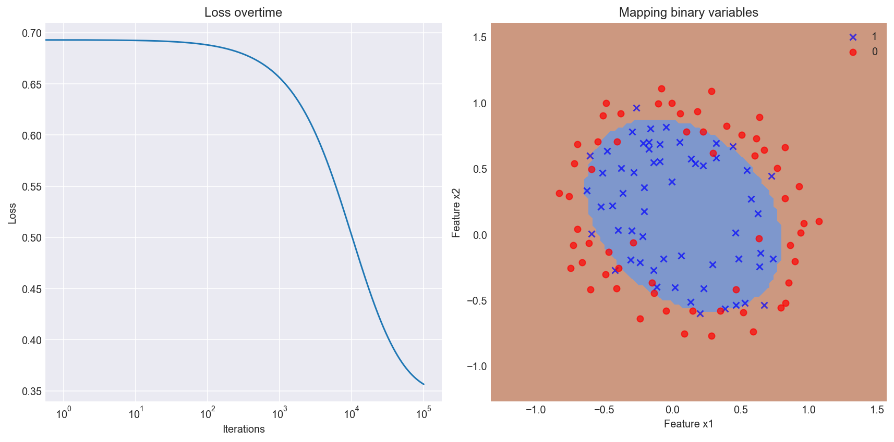

## Polynomial Logistic Regression with regularization

#### Loss curve and final boundary line using a polynomial function with regularization.
Here we use a polynomial function  to model our data.

#### Loss function with regularization

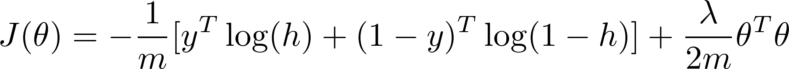

#### Gradient descent update

#### Acknowledgements
-   Dataset from Andrew Ng Machine Learning Stanford edu MOOC.
